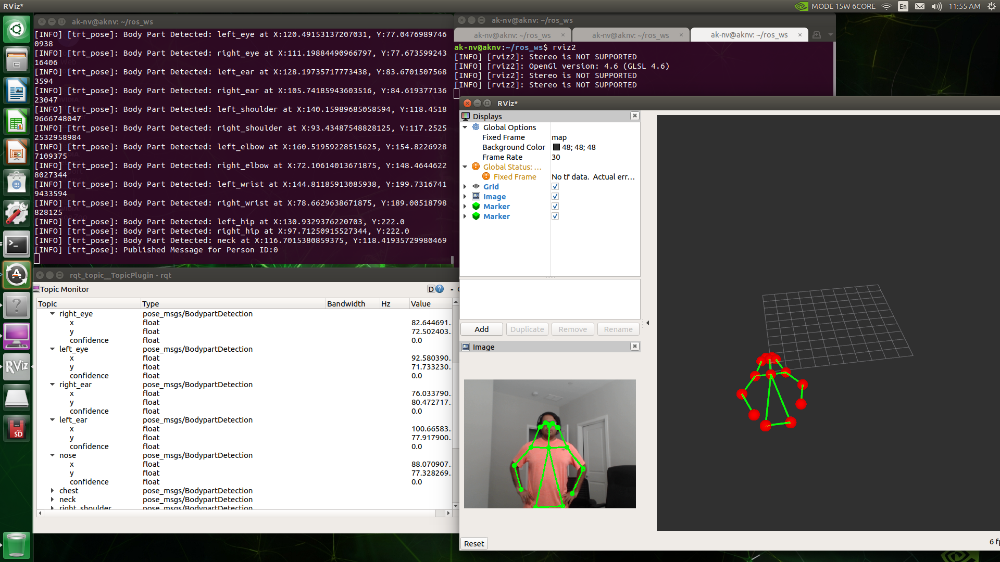

# ros2_trt_pose
[NVIDIA Developer Blog](https://developer.nvidia.com/blog/implementing-robotics-applications-with-ros-2-and-ai-on-jetson-platform-2/)

In this repository, we build ros2 wrapper for [trt_pose](https://github.com/NVIDIA-AI-IOT/trt_pose) for real-time pose estimation on NVIDIA Jetson.

## Package outputs:
- Pose message
- Pose detection image message
- Visualization markers
- Launch file for RViz



## Requirements:
- ROS 2 Eloquent: <br/>
    - [Docker Support](https://github.com/NVIDIA-AI-IOT/ros2_trt_pose/blob/main/docker/README.md) <br/>
    - [Install Instructions](https://index.ros.org/doc/ros2/Installation/Eloquent/Linux-Development-Setup/) <br/>
- trt_pose
    - [Dependencies for trt_pose](https://github.com/NVIDIA-AI-IOT/trt_pose#step-1---install-dependencies) <br/>
    - [Install trt_pose] (https://github.com/NVIDIA-AI-IOT/trt_pose#step-2---install-trt_pose) <br/>

## Build:
- Clone repository under ros2 workspace <br/>
```
$ cd ros2_ws/src/
$ git clone https://github.com/NVIDIA-AI-IOT/ros2_trt_pose.git
```
- Install requirements using ```rosdep``` <br/>
```
$ rosdep install --from-paths src --ignore-src --rosdistro eloquent -y
```
- Build and Install ros2_trt_pose package <br/>
```
$ colcon build
$ source install/local_setup.sh
```

## Run
- Change Power Mode for Jetson
``` sudo nvpmodel -m2 ``` (for Jetson Xavier NX) <br/>
``` sudo nvpmodel -m0 ``` (for Jetson Xavier and Jetson Nano) <br/>
- Input Images are captured using ```image_tools``` package <br/>
``` ros2 run image_tools cam2image ```
- Keep ```trt_pose``` related model files in ```base_dir```, it should include:<br/>
    - Model files for resnet18 or densenet121 [download link](https://github.com/NVIDIA-AI-IOT/trt_pose#step-3---run-the-example-notebook) 
    - Human Pose points [json file](https://github.com/NVIDIA-AI-IOT/trt_pose/blob/master/tasks/human_pose/human_pose.json)
- For running you can use Launch file or manually run each node: <br/>
    - Run using Launch file <br/>
    ```
    $ ros2 launch ros2_trt_pose pose-estimation.launch.py
    ```
    *Note: Update rviz file location in launch file in* ```launch/pose_estimation.launch.py``` <br/>

    - Run ```ros2_trt_pose``` node <br/>
    ``` 
    $ ros2 run ros2_trt_pose pose-estimation --ros-args -p base_dir:='<absolute-path-to-base_dir>'
    ```
    - For following use separate window for each:<br/>
        - See Pose message <br/>
        ```
        $ source install/local_setup.sh
        $ ros2 run rqt_topic rqt_topic
        ```
        - Visualize markers <br/>
        ```
        $ ros2 run rviz2 rviz2 launch/pose_estimation.rviz
        ```

## Other related ROS 2 projects
- [ros2_torch_trt](https://github.com/NVIDIA-AI-IOT/ros2_torch_trt) : ROS2 Real Time Classification and Detection <br/>
- [ros2_deepstream](https://github.com/NVIDIA-AI-IOT/ros2_deepstream) : ROS2 nodes for DeepStream applications <br/>
- [ros2_jetson_stats](https://github.com/NVIDIA-AI-IOT/ros2_jetson_stats) : ROS 2 package for monitoring and controlling NVIDIA Jetson Platform resources <br/>

